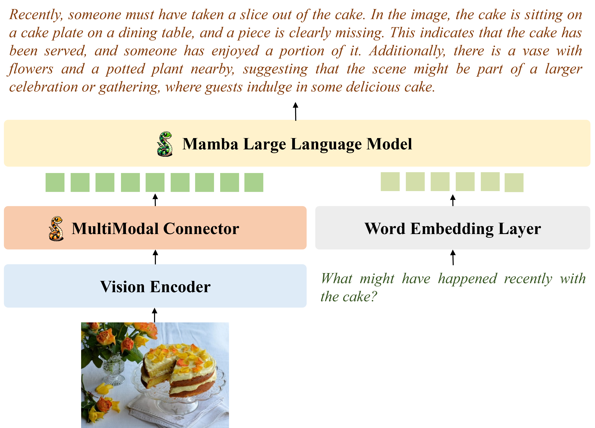

# VL-Mamba

<div align="center">

<h2><a href="https://yanyuanqiao.github.io/vl-mamba/">VL-Mamba: Exploring State Space Models for Multimodal Learning</a></h2>

[](https://arxiv.org/abs/2403.13600) 


</div>

## Introduction
Multimodal large language models (MLLMs) have attracted widespread interest and have rich applications. However, the inherent attention mechanism in its Transformer structure requires quadratic complexity and results in expensive computational overhead. Therefore, in this work, we propose VL-Mamba, a multimodal large language model based on state space models, which have been shown to have great potential for long-sequence modeling with fast inference and linear scaling in sequence length. Specifically, we first replace the transformer-based backbone language model such as LLama or Vicuna with the pre-trained Mamba language model. Then, we empirically explore how to effectively apply the 2D vision selective scan mechanism for multimodal learning and the combinations of different vision encoders and variants of pretrained Mamba language models. The extensive experiments on diverse multimodal benchmarks with competitive performance show the effectiveness of our proposed VL-Mamba and demonstrate the great potential of applying state space models for multimodal learning tasks.

## License
This project is released under the [MIT License](./LICENSE)

## Citation
```
@article{qiao2024vlmamba,
        title={VL-Mamba: Exploring State Space Models for Multimodal Learning},
        author={Qiao Yanyuan, Yu Zheng, Guo Longteng, Chen Sihan, Zhao Zijia, Sun Mingzhen, Wu Qi, and Liu Jing},
        journal={arXiv preprint arXiv:2403.13600},
        year={2024}
      }
```

## Acknowledgement

This repository is built based on [LLaVA](https://github.com/haotian-liu/LLaVA),  [Mamba](https://github.com/state-spaces/mamba), and [VMamba](https://github.com/MzeroMiko/VMamba) for their public code release.
